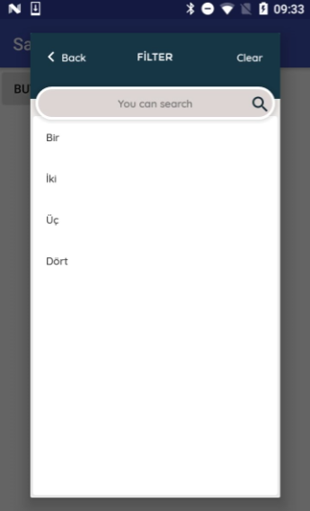

[](https://jitpack.io/#barisatalay/filter-dialog-activity)

# filter-dialog-activity
Filter Dialog Activity for Android Projects


#Screen Shots



## Usage

### Step 1
```groovy
allprojects {
		repositories {
			...
			maven { url 'https://jitpack.io' }
		}
	}
```

### Step 2

Add dependencies in build.gradle.
```groovy
    dependencies {
       compile 'com.github.barisatalay:filter-dialog-activity:1.0.3'
    }
```

### Step 3 (Use of library)
Create FilterDialog;
```java
   List<mdlPerson> personList = new ArrayList<>();

   personList.add(new mdlPerson("1","Bir"));
   personList.add(new mdlPerson("2","İki"));
   personList.add(new mdlPerson("3","Üç"));
   personList.add(new mdlPerson("4","Dört"));
   
   final FilterDialog filterDialog = new FilterDialog<mdlPerson>(MainActivity.this);
   
   filterDialog.setList(personList);
   
   filterDialog.show("code", "name", new DialogListener() {
   	@Override
   	public void onResult(FilterItem selectedItem) {
   		Toast.makeText(MainActivity.this, "Selected is: " + selectedItem.getName(), Toast.LENGTH_SHORT).show();
   	}
   });
``` 

## Thanks
- [Emre Can Akcan](https://github.com/emreakcan)


## Contact me
 If you have a better idea or way on this project, please let me know, thanks :)

[Email](mailto:b.atalay07@hotmail.com)

[My Blog](http://brsatalay.blogspot.com.tr)

[My Linkedin](http://linkedin.com/in/barisatalay07/)
